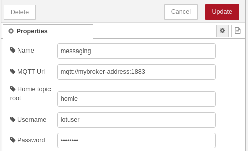

# node-red-contrib-node-homie-red
Provides nodes to interact with devices published on mqtt following the [Homie 5.0 convention](https://homieiot.github.io/).

[](https://homieiot.github.io/)

This package is based on [node-homie](https://github.com/schaze/node-homie#readme) and [hc-node-homie-smarthome](https://github.com/homie-homecontrol/hc-node-homie-smarthome#readme).

## Usage scenarios

The Homie convention differentiates between __Devices__ and __Controllers__:

* __Device__
  > "An instance of a physical piece of hardware is called a device. For example, a car, an Arduino/ESP8266 or a coffee machine. It __publishes__ Nodes and Properties to the MQTT broker." (see https://homieiot.github.io/implementations)

* __Controller__
  > "A controller does not announce anything to the MQTT broker, but __discovers__ and __interacts__ with Devices. There can be more than one Controller interacting with the different devices on the same broker." (see https://homieiot.github.io/implementations)
    
This node package provides nodes to support both device ([virtual devices](#reference-virtualdevice)) and controller (discover and interact with existing devices) scenarios.

## Controller Nodes
Configuration Nodes:
* homie-config

Palette Nodes:
* Device (homie-device)
* Device Log (homie-device-log)
* Device Alert (homie-device-alert)
* Property (homie-property)
* Property Target (homie-property-target)

### homie-config
Here you specify the connection to your mqtt broker.
Please note that also for controller mode the user needs publish rights at least for the properties `{topicRoot}/5/<device>/<node>/<property>/set` topic.



Please find the documentation for the fields below:

__Name__
* name of the configuration node

__MQTT Url__
* the connection address of the mqtt broker. This can be a `mqtt://` protocol address or `ws://` | `wss://` address depending on your scenario. If no port is specified defaults will be assumed. (mqtt: 1883, ws: 80, wss: 443)

__Homie topic root__
* MQTT topic under which all homie devices are published. By convention this defaults to `homie`, however for your testing or developing reasons this can be changed here as not to disturb productive usage. The actual MQTT topics will be `{topicRoot}/5/{device-id}/...` following the Homie 5.0 convention.

__Username__
* Username for the MQTT connection. If the MQTT broker is unsecured this can be left empty.

__Password__
* Password for the MQTT connection. If the MQTT broker is unsecured this can be left empty.


### Device (homie-device)


Represents a homie device. 

__Input__

If a message is sent to the node the current device state will be emitted.

__Output__

Will send outgoing messages with the device state (init, ready, disconnected, sleeping, lost).


Outgoing messages include device state in the payload and device id as separate field:

```json
{
    "payload": "ready",
    "device": "security"
}
```

> TODO: Implement dynamic device selection via topic like for homie-property.


### Property (homie-property)


Represents a property of a homie device. The node will send property value updates as outgoing messages.

__Input__

Message payload will be sent to the homie property via `.../set` topic requesting the value update.
If a topic is included in the incoming message it will be used to dynamically select the property to act on. (format: `<deviceId>/<nodeId>/<propertyId>`).
> TODO: Implement a switch in the node which controls if the topic should be used or not. There are scenarios where a topic is present but should not be used.

If no payload is included and the property is a `retained` property the node will emit only the current value.

Special case:
If the property is non-retained and the property was selected dynamically via the `topic` attribute a value message will be sent out immediately with the input value (without it being received from the property as there is no subscription to it due to the dynamic selection)
> TODO: Maybe this behaviour should be optional.

__Output__

Will send outgoing messages with the property's value as payload.
Besides that the message will include additional metadata about the property:

```json
{
    "payload": "false",
    "topic": "group-3/switch/state",
    "homieDevice": "group-3",
    "homieNode": "switch",
    "homieProperty": "state",
    "propertyAttrs": {
        "settable": true,
        "retained": true,
        "id": "state",
        "datatype": "boolean",
        "name": "On/Off state"
    }
}

{
    "payload": "22.5",
    "topic": "meq0006971/climate/temperature",
    "homieDevice": "meq0006971",
    "homieNode": "climate",
    "homieProperty": "temperature",
    "propertyAttrs": {
        "settable": false,
        "retained": true,
        "id": "temperature",
        "datatype": "float",
        "name": "Current temperature",
        "unit": "°C"
    }
}
```

### Device Alert (homie-device-alert)

Represents alert messages of a discovered homie device under <code>$alert/&lt;alertId&gt;</code>.

__Input__

If a message is sent to the node, all active alerts are emitted as an array in `payload`.

__Output__

Will emit alert events from the selected device.

```json
{
    "device": "security",
    "alertId": "$lowbattery",
    "topic": "security/$alert/$lowbattery",
    "payload": "battery below 10%",
    "cleared": false,
    "action": "set"
}
```

If an alert is cleared, `payload` becomes `null` and `action` is `clear`.

### Device Log (homie-device-log)

Represents log messages of a discovered homie device under <code>$log/&lt;level&gt;</code>.

__Output__

Will emit log events from the selected device.

```json
{
    "device": "security",
    "level": "warn",
    "topic": "security/$log/warn",
    "payload": "battery voltage unstable",
    "message": "battery voltage unstable"
}
```

### Property Target (homie-property-target)

Represents the `$target` value of a discovered homie property.

__Input__

If a message is sent to the node the current target value is emitted. If no property is configured, `msg.topic` can be used with `<deviceId>/<nodeId>/<propertyId>`.

__Output__

Will output target value changes and target snapshots.

```json
{
    "topic": "heater-1/thermostat/temperature",
    "payload": "22.5",
    "target": "22.5",
    "homieDevice": "heater-1",
    "homieNode": "thermostat",
    "homieProperty": "temperature"
}
```
<a name="reference-virtualdevice"></a>
## Virtual Device

Configuration Nodes:
* homie-vdevice-config

Palette Nodes:
* Virtual Device (homie-vdevice)
* vprop value (homie-vproperty-value-update)
* vprop /set (homie-vproperty-set-command)
* vdevice log (homie-vdevice-log-update)
* vdevice alert (homie-vdevice-alert-update)
* vprop target (homie-vproperty-target-update)


### homie-vdevice-config
A configuration node that creates a virtual device owned by Node-RED.
The specification of a device is too complex to build a nice user interface around it. Therefore the spec has to be provided as JSON input. The datamodel is more or less straight forward with some specials to it.
In general you can more or less model the devices, nodes and properties as they would be published via the mqtt topic structure with the following differences:

* attributes are written without the "$" prefix for ease of use (`name` instead of `$name`)
* ids have to be specified as fields, nodes and properties are arrays (lists) instead of `dictionaries/maps` like you would expect in the topic hierarchy.

__Explanation__

This will show the tree structure level by level.

Device:
```yaml
id: deviceId
name: device name
nodes:
    - node1
    - node2
    - node3
```

For each node:
```yaml
id: nodeId
name: node name
type: node type
properties:
    - property1
    - property2
    - property3
```

For each property:
```yaml
id: propertyId
name: property name
datatype: boolean
settable: true
```

All together this looks like this:

```yaml
id: deviceId
name: device name
nodes:
    - id: nodeId
      name: node name
      type: node type
      properties:
        - id: propertyId
          name: property name
          datatype: boolean
          settable: true
        - id: propertyId
          name: property name
          datatype: boolean
          settable: true
    - id: nodeId
      name: node name
      type: node type
      properties:
        - id: propertyId
          name: property name
          datatype: boolean
          settable: true
        - id: propertyId
          name: property name
          datatype: boolean
          settable: true
```

Below you find an actual JSON example that can be used directly for testing.
```json
{
    "id": "node-red-virtual-device-1",
    "name": "Virtual a test device",
    "nodes": [
        {
            "id": "switch",
            "name": "Virtual switch",
            "type": "virtual-switch",
            "properties": [
                {
                    "id": "state",
                    "datatype": "boolean",
                    "passThrough": false,
                    "name": "Virtual switch state",
                    "settable": true,
                    "propertyOpts": {
                        "readValueFromMqtt": true
                    }
                }
            ]
        }
    ]
}
```

In Homie 5.0, the device publishes a `$description` JSON document and a `$state` topic on MQTT under `{topicRoot}/5/{device-id}/...`. Property values are published as individual topics under the device's topic tree.

__General note__
The following fields on the device cannot be specified:
* state
* homie
* extensions


As you can see in the example above there are a few extra configuration options that can be used. Below you can find them listed by homie structure element.

__Node level extra configuration__

`passThrough` (boolean, default `false`): 

* when set to `true`, all properties below this node will 'autoconfirm' /set messages sent to them. Which means they will simply update their value state with the value sent to /set. 

* when set to `false`, you have to take care to update the property value in your flow yourself using the `vprop value (homie-vproperty-value-update)` node.

`fromSmarthome` (object):
* node-homie-red uses the `node-homie` and `hc-node-homie-smarthome` libraries under the hood. The latter defines a set of standard node types for smarthome usage in the homie-homecontrol smarthome system. This option offers easy specification of these default nodes in your devices. For more details see the section [Smarthome Spec](#reference-smarthome-spec).


`propertyOpts` (object, default `{ "readValueFromMqtt": true, "readTimeout": 3000 }`):

* node-homie offers to read the current value of a property from mqtt when creating the device. Basically using mqtt as persistent storage itself. This is useful to retain the last value of the property in case of a Node-RED restart for example. 

* `readValueFromMqtt`: Default is to read the last value in on device initialization - if you set this to false make sure to take care of setting the initial value for the property after a Node-RED restart.
* `readTimeout`: max time in milliseconds to wait for a message to be received from mqtt for the property topic. Please note for new empty properties this leads to a delay of `readTimeout` milliseconds before the device finishes initializing (transitions to state ready).
* data format:
    ```json
    {
        "readValueFromMqtt": true,
        "readTimeout": 3000
    }
    ```


__Property level extra configuration__

`passThrough` (boolean, default `false`): 

* when set to `true`, the property will 'autoconfirm' /set messages sent to it. Which means it will simply update its value state with the value sent to /set. 

* when set to `false`, you have to take care to update the property value in your flow yourself using the `vprop value (homie-vproperty-value-update)` node.

* this will overwrite any setting on node level per property


`propertyOpts` (object, default `{ "readValueFromMqtt": true, "readTimeout": 3000 }`):

* node-homie offers to read the current value of a property from mqtt when creating the device. Basically using mqtt as persistent storage itself. This is useful to retain the last value of the property in case of a Node-RED restart for example. 

* `readValueFromMqtt`: Default is to read the last value in on device initialization - if you set this to false make sure to take care of setting the initial value for the property after a Node-RED restart.
* `readTimeout`: max time in milliseconds to wait for a message to be received from mqtt for the property topic. Please note for new empty properties this leads to a delay of `readTimeout` milliseconds before the device finishes initializing (transitions to state ready).
* data format:
    ```json
    {
        "readValueFromMqtt": true,
        "readTimeout": 3000
    }
    ```


<a name="reference-smarthome-spec"></a>
__Smarthome Spec__

The smarthome spec offers quick definition of nodes and properties according to the hc-smarthome node definition without having to specify every single property manually. (see [hc-node-homie-smarthome](https://github.com/homie-homecontrol/hc-node-homie-smarthome#readme))


For example, if you only need a simple switch the following device spec:
```json
{
    "id": "node-red-virtual-device-2",
    "name": "Virtual switch device",
    "nodes": [
        {
            "id": "switch",
            "fromSmarthome": {
                "type": "hc-smarthome/v2/cap/switch"
            }
        }
    ]
}
```
Would result in a device with a switch node containing `state` (boolean, settable) and `action` (enum, non-retained) properties.


***Data format for `fromSmarthome`***:
```json
{
    "type": "hc-smarthome/v2/cap/<typename>",
    "config": {
        // typespecific node configuration
    }
}

```

`type`

* The following types are supported:
    * `hc-smarthome/v2/cap/battery`
    * `hc-smarthome/v2/cap/switch`
    * `hc-smarthome/v2/cap/contact`
    * `hc-smarthome/v2/cap/climate`
    * `hc-smarthome/v2/cap/button`
    * `hc-smarthome/v2/cap/tilt`
    * `hc-smarthome/v2/cap/motion`
    * `hc-smarthome/v2/cap/thermostat`
    * `hc-smarthome/v2/cap/mediaplayer`
    * `hc-smarthome/v2/cap/powermeter`
    * `hc-smarthome/v2/cap/maintenance`
    * `hc-smarthome/v2/cap/level`
    * `hc-smarthome/v2/cap/shutter`
    * `hc-smarthome/v2/cap/color`
    * `hc-smarthome/v2/cap/text`

`config`
* Each type has its own configuration. For more details see the [technical spec](./docs/vdevice-config-datamodel.md) of the data model.


***Overriding or extending on default nodes***

You can still provide a `properties` field in combination with `fromSmarthome`. Any matching property ids will overwrite the default ones where supported. You can also extend the node with additional properties (however then it is not adhering to the standard any more)

### Virtual Device (homie-vdevice)


Update virtual device state.


__Input__

If a message is sent to the node the device will be set to the payload value.
If no payload is specified only the current state will be emitted via the output.

__Output__

Will send outgoing messages with the device state (init, ready, disconnected, sleeping, lost).


Outgoing messages include device state in the payload and device id as separate field:

```json
{
    "payload": "ready",
    "device": "security"
}
```


### vprop value (homie-vproperty-value-update)


Update virtual device's property value.


__Input__

If a message is sent to the node the property's value will be set to the payload value. Please note that this is different from the `homie-property` node as it will update the internal value of the property which will be then published to mqtt. The `homie-property` will send a /set message which is different.


### vprop /set (homie-vproperty-set-command)


Emits when a message is published under the virtual device's property '/set' topic.

__Output__

Message with /set value that was sent to the device via mqtt.


Outgoing messages include the /set value as payload and a topic and property field with the property path:

```json
{
    "payload": "true",
    "topic": "lamp-1/switch/state",
    "property": "lamp-1/switch/state"
}
```

### vdevice alert (homie-vdevice-alert-update)

Sets or clears virtual device alerts by publishing to `$alert/<alertId>`.

__Input__

Uses configured `alertId` (or `msg.alertId` if set).

* If `msg.payload` contains a value, the alert is set.
* If `msg.payload` is `null`/`undefined`, or `msg.clear === true`, the alert is cleared.

### vdevice log (homie-vdevice-log-update)

Publishes virtual device log messages to `$log/<level>`.

__Input__

Uses configured `level` (or `msg.level` if set).

* `msg.payload` is converted to string and published as log message.

### vprop target (homie-vproperty-target-update)

Updates the `$target` value of a virtual property.

__Input__

* If `msg.payload` contains a value, the target is updated.
* If `msg.payload` is `null`/`undefined`, the target is cleared.

# Breaking changes (v4 → v5)

## Homie protocol
- Topics now use `{topicRoot}/5/{device-id}/...` format (includes `/5/` version segment)
- Device metadata is a single JSON `$description` document instead of individual MQTT topics
- Device states remain `init`, `ready`, `disconnected`, `sleeping`, `lost`; alerts are exposed via `$alert/<id>`
- Properties in output messages no longer include `tags` and `meta` fields (removed in v5)

## Smarthome namespace
All `fromSmarthome` type strings changed from `homie-homecontrol/v1/type=X` to `hc-smarthome/v2/cap/X`:
- `homie-homecontrol/v1/type=switch` → `hc-smarthome/v2/cap/switch`
- `homie-homecontrol/v1/type=dimmer` → `hc-smarthome/v2/cap/level`
- `homie-homecontrol/v1/type=colorlight` → `hc-smarthome/v2/cap/color`
- `homie-homecontrol/v1/type=weather` → `hc-smarthome/v2/cap/climate`
- `homie-homecontrol/v1/type=motionsensor` → `hc-smarthome/v2/cap/motion`
- `homie-homecontrol/v1/type=tiltsensor` → `hc-smarthome/v2/cap/tilt`
- and all other types follow the same `hc-smarthome/v2/cap/{name}` pattern

## API changes (from underlying libraries)
- `setAttributes()` → `patchAttributes()`
- `addInitNode()` → `add()` (nodes added synchronously before `onInit()`)
- `HomieProperty.parent` → `HomieProperty.node`
- Model type renames: `BaseItemAttributes` → `BaseAttributes`, `HomieNodeAttributes` → `NodeAttributes`, `HomiePropertyAttributes` → `PropertyAttributes`
